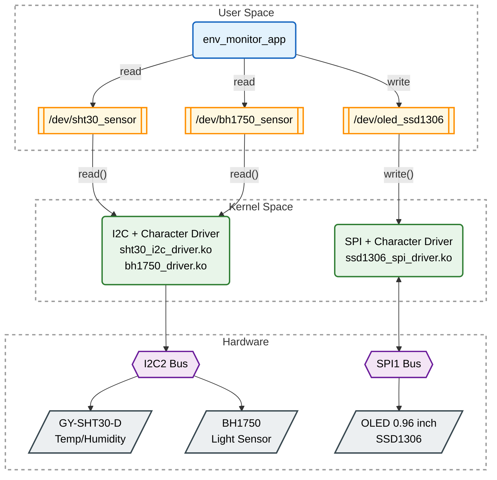

# Hệ Thống Giám Sát Môi Trường (Environmental Monitoring System)

## Mô Tả Dự Án

Hệ thống giám sát môi trường được xây dựng trên **BeagleBone Black**, phát triển toàn bộ driver cho sensors và display từ đầu - từ Device Tree và kernel drivers xuống user-space application - **không sử dụng bất kỳ thư viện vendor hoặc driver có sẵn nào**.

## Kiến Trúc Hệ Thống

### Sơ Đồ Kiến Trúc



### Cấu Trúc Thư Mục

```
enviromental-monitoring-system/
├── kernel_module_drivers/          # Kernel drivers tự viết
│   ├── bh1750/                     # Driver cảm biến ánh sáng BH1750
│   │   ├── device_tree.txt         # Device Tree configuration
│   │   └── driver/
│   │       ├── Makefile
│   │       └── bh1750_driver.c     # I2C driver cho BH1750
│   │
│   ├── gy-sht30-d/                 # Driver cảm biến nhiệt độ/độ ẩm SHT30
│   │   ├── device_tree.txt         # Device Tree configuration
│   │   └── driver/
│   │       ├── Makefile
│   │       └── sht30_i2c_driver.c  # I2C driver cho SHT30
│   │
│   └── oled_sdd1306/               # Driver màn hình OLED SSD1306
│       ├── device_tree.txt         # Device Tree configuration
│       └── driver/
│           ├── Makefile
│           └── ssd1306_spi_driver.c # SPI driver cho OLED
│
└── app/                            # User-space application (C++)
    ├── inc/
    │   └── display_data.h          # Header file
    ├── src/
    │   ├── display_data.cpp        # Đọc sensors và ghi OLED
    │   └── env_monitor_app.cpp     # Main application
    └── Makefile                    # Build system
```

### Luồng Dữ Liệu

1. **User Space → Kernel Space (READ)**:
   - Application gọi `read()` trên `/dev/sht30_sensor` và `/dev/bh1750_sensor`
   - Kernel drivers đọc dữ liệu từ I2C2 bus
   - Dữ liệu được trả về user space

2. **User Space → Kernel Space (WRITE)**:
   - Application gọi `write()` trên `/dev/oled_ssd1306`
   - Kernel driver gửi dữ liệu qua SPI1 bus
   - OLED hiển thị thông tin

## Phần Cứng

### Sensors & Display
- **BH1750**: Cảm biến cường độ ánh sáng (I2C)
- **SHT30**: Cảm biến nhiệt độ và độ ẩm (I2C)
- **SSD1306**: Màn hình OLED 128x64 (SPI)

### Platform
- **BeagleBone Black**: ARM Cortex-A8, Linux kernel

## Tính Năng

### Kernel Drivers
- ✅ Device Tree configuration cho từng sensor/display
- ✅ I2C driver cho BH1750 (light sensor)
- ✅ I2C driver cho SHT30 (temperature & humidity)
- ✅ SPI driver cho SSD1306 OLED display
- ✅ Character device interface (`/dev/bh1750_sensor`, `/dev/sht30_sensor`, `/dev/oled_ssd1306`)

### User Application
- ✅ Đọc dữ liệu từ sensors qua device files
- ✅ Hiển thị dữ liệu lên OLED display
- ✅ In dữ liệu ra console để debug
- ✅ Signal handling (SIGINT, SIGTERM)
- ✅ Viết bằng C++ (procedural style)

## Build & Deploy

### 1. Build Kernel Drivers

```bash
# Build từng driver
cd kernel_module_drivers/bh1750/driver
make

cd kernel_module_drivers/gy-sht30-d/driver
make

cd kernel_module_drivers/oled_sdd1306/driver
make
```

### 2. Load Kernel Modules

```bash
# Load drivers vào kernel
sudo insmod kernel_module_drivers/bh1750/driver/bh1750_driver.ko
sudo insmod kernel_module_drivers/gy-sht30-d/driver/sht30_i2c_driver.ko
sudo insmod kernel_module_drivers/oled_sdd1306/driver/ssd1306_spi_driver.ko

# Kiểm tra drivers đã load
lsmod | grep -E "bh1750|sht30|ssd1306"

# Kiểm tra device files
ls -l /dev/bh1750_sensor /dev/sht30_sensor /dev/oled_ssd1306
```

### 3. Build Application

```bash
cd app
make

# Chạy application
sudo ./env_monitor_app
```

### 4. Unload Kernel Modules

```bash
sudo rmmod ssd1306_spi_driver
sudo rmmod sht30_i2c_driver
sudo rmmod bh1750_driver
```

## Device Tree Configuration

Mỗi driver đều có file `device_tree.txt` chứa cấu hình Device Tree cần thiết. Cần thêm các node này vào Device Tree của BeagleBone Black trước khi load drivers.

## Yêu Cầu Hệ Thống

- **Hardware**: BeagleBone Black
- **OS**: Linux kernel với I2C và SPI support
- **Toolchain**: 
  - Kernel: gcc cho kernel module compilation
  - Application: g++ với C++11 support
- **Permissions**: Root/sudo để load kernel modules và access device files

## Đặc Điểm Kỹ Thuật

### Kernel Space
- Character device drivers
- I2C subsystem integration
- SPI subsystem integration
- Device Tree binding
- Kernel module parameters

### User Space
- Direct device file I/O (`open`, `read`, `write`)
- Signal handling
- C++ với iostream
- Polling-based sensor reading (5 giây/lần)

## Lưu Ý

- Cần quyền root để load/unload kernel modules
- Cần quyền root để chạy application (access device files)
- Device Tree phải được cấu hình đúng trước khi load drivers
- Kiểm tra I2C và SPI bus addresses phù hợp với hardware

## Tác Giả

Dự án được phát triển hoàn toàn từ đầu, không sử dụng vendor libraries hay pre-built drivers.